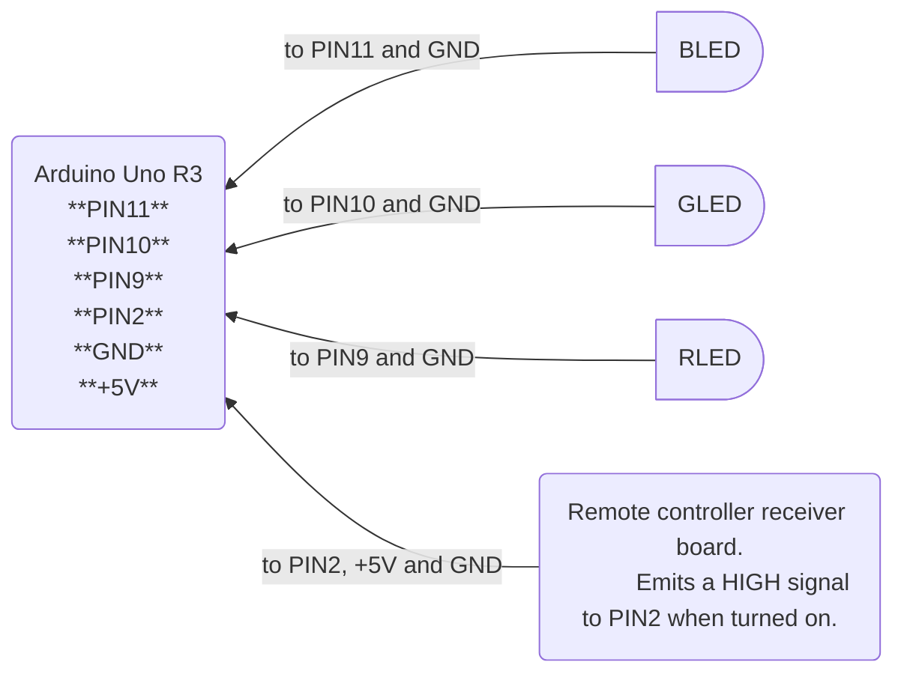

# arduino-led-kontroller

### Simple RGB LED controller for Arduino Uno R3

- Uses Arduino Uno R3 to drive an RGB LED / LED strip connected to PWM pins `9`, `10` and `11`.
- Program only runs the LED while a remote control signal is sensed HIGH in Digital pin `2`.
- Toggling switch state advances the LED effect program.
- (Remote control signal can be simulated by connecting a positive line through a series resistor to pin `2` via normally-closed switch.)

### References

- https://support.arduino.cc/hc/en-us/articles/9350537961500-Use-PWM-output-with-Arduino
- https://docs.arduino.cc/language-reference/en/functions/external-interrupts/attachInterrupt/
